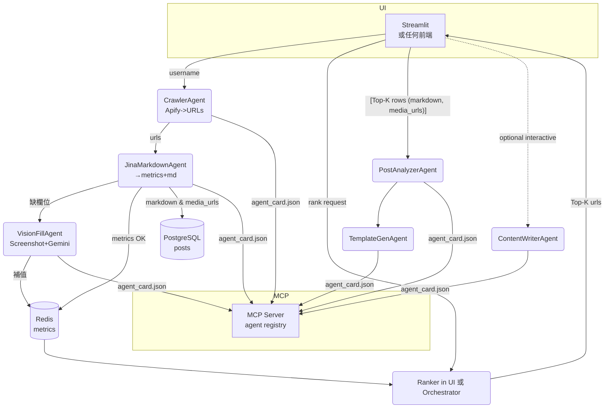

### 要避免「抓兩次又存兩份」— 給你一個 **三層資料策略**

| 層級                    | 目的                                | 典型大小 / TTL                        | 建議存放                                   | 何時刪        |
| --------------------- | --------------------------------- | --------------------------------- | -------------------------------------- | ---------- |
| **Tier-0** <br>*臨時快取* | 排序用 **五欄指標**<br>(views / likes …) | 100 筆 × 100 byte ≈ 10 KB / 10 min | **Redis** hash<br>`metrics:{url}`      | 排序結束立即 DEL |
| **Tier-1** <br>*輕量原文* | Markdown / JSON 文字內容 (無圖)         | 10 KB/帖                           | **PostgreSQL** `posts.markdown` (TEXT) | 永久留存       |
| **Tier-2** <br>*重資源*  | Screenshot PNG、影片封面…              | 150 KB/帖                          | 物件儲存 (S3 / GCS) `media/{urlhash}.png`  | 分析完可保留或週期清 |

> **重點**：排序只看 Tier-0；**進入分析**才需要 Tier-1 / Tier-2。
> 因此 **Jina 在第一次就把 Tier-1 存進 DB**，以後不必再打 API。

---

## Pipeline 重新排列

```mermaid
graph TD
  Crawler[Apify<br>→ URLs] -->|bulk|  JinaMetrics(Jina<br>Markdown→ metrics+md)
  JinaMetrics -->|①寫 Redis Tier-0| Redis[(metrics cache)]
  JinaMetrics -->|②寫 PG Tier-1|  PG[(posts table)]
  Orchestrator -->|pull metrics from Redis| Sort[權重排序]
  Sort -->|取 top-K url| Analysis分流

  subgraph 分流
    Analysis分流 -->|文字|  NLP[Content-Analyzer]
    Analysis分流 -->|圖/影| Vision[Snapshot + Gemini Vision<br>(Tier-2)]
  end
```

### 步驟解釋

1. **CrawlerAgent**

   * 只產生 `urls[]`。不抓任何內容。
2. **JinaAgent** (單一回合完成兩件事)

   1. `GET https://r.jina.ai/…` `X-Return-Format: markdown`

      * parse 出 **metrics** → 寫 Redis `HSET metrics:{url}`
      * markdown string → `INSERT … ON CONFLICT (url) UPDATE markdown`
   2. 若 metrics 缺欄 → **立即** 呼叫 `vision_agent.fill_missing`（會寫回 Redis + PG）
3. **Sort / RankerAgent**

   * 直接 `HGETALL metrics:*`；用公式算分，`sorted()`，產生 `top_urls`.
4. **分析階段**

   * 需要正文時，`SELECT markdown FROM posts WHERE url IN top_urls`.
   * 若圖／影片：VisionAgent 再去 `Jina screenshot` + Gemini（或直接用前面已存的 PNG）。

---

## PostgreSQL 兩張表（最小化重覆）

```sql
CREATE TABLE posts (
  url         TEXT    PRIMARY KEY,
  author      TEXT,
  markdown    TEXT,          -- tier-1
  media_urls  JSONB,         -- ["https://...jpg", ...]
  created_at  TIMESTAMP,
  last_seen   TIMESTAMP DEFAULT now()
);

CREATE TABLE post_metrics (
  url          TEXT PRIMARY KEY REFERENCES posts(url),
  views        BIGINT,
  likes        BIGINT,
  comments     BIGINT,
  reposts      BIGINT,
  shares       BIGINT,
  score        DOUBLE PRECISION GENERATED ALWAYS AS
              (views*1.0 + likes*0.3 + comments*0.3
               + reposts*0.1 + shares*0.1) STORED
);
CREATE INDEX idx_score_desc ON post_metrics (score DESC);
```

---

## Orchestrator 排序（不再重撈 Jina）

```python
async def rank_top(username:str, k:int=100):
    # 取這個 user 的 URL 清單
    urls = await redis.keys(f"metrics:https://www.threads.com/@{username}/*")

    pipe = redis.pipeline()
    for key in urls:
        pipe.hgetall(key)
    metrics = await pipe.execute()      # list[dict]

    # Redis 內已經是完整五欄
    metrics = [m for m in metrics if m]  # 過濾空值
    metrics.sort(key=lambda m: float(m["score"]), reverse=True)

    top = [m["url"] for m in metrics[:k]]

    # 後續分析需要正文
    rows = (
        await db.execute(
            text("SELECT url, markdown, media_urls FROM posts WHERE url = ANY(:u)")
            .bindparams(u=top)
        )
    ).mappings().all()

    # 分流
    for row in rows:
        if not row.media_urls:                # 純文字
            await call_agent("content_analyzer", row)
        else:                                 # 有圖/影
            await call_agent("vision_agent", row)
```

---

## FAQ

| 疑問                     | 回覆                                                           |
| ---------------------- | ------------------------------------------------------------ |
| **為何不用 Jina 再抓一次正文？**  | markdown 已寫進 PG，直接拿。再次呼叫浪費 1 × API & Latency。                |
| **Redis 如果 TTL 過了怎辦？** | 排序邏輯通常 < 10 min；真過期就重算一次，最多再拉 PG 補空值。                        |
| **截圖要不要也持久化？**         | 若 Vision 很貴 → 建議把 `screenshot bytes` 上傳 S3，URL 存 PG；否則可以即時抓。 |
| **Apify 能直接存正文嗎？**     | Threads HTML 髒又重；Markdown 乾淨、免算 View，所以還是交給 Jina Reader。     |

---

### 這樣你就得到

* **一次爬** → 兩份資料：指標(Redis) + 正文(PG)。
* 權重排序不再 hit 網路；
* 後續分析無需重抓；
* 圖片／影片才進 Vision，省 Token。

完全符合 A2A 可插拔，稍後要水平擴張只要把 Crawler / Vision 佈多副本或掛到 NATS 即可。


###########

### 先說「binary / raw bytes」――你現在的作法已經對了

* `X-Return-Format: screenshot` 時 **Jina Reader 直接回傳 `Content-Type: image/png`**，
  `requests.get(...).content` 就是一個 `bytes` 物件。
* Google Gemini v1/v2 SDK (`types.Part.from_bytes`) **可接受 raw bytes**，所以

  ```python
  part = types.Part.from_bytes(mime_type="image/png", data=response.content)
  ```

  **完全不用** `base64.b64encode()` ➜ `str` ➜ 再 `decode()` 這一串轉換。
  Base64 只有「要把 binary 塞進 JSON / protobuf 文字欄位」時才需要。

---

## 那 Screenshot 要不要存檔？

| 目的                                     | 是否必存？  | 建議                                                                   |
| -------------------------------------- | ------ | -------------------------------------------------------------------- |
| **只為了補 `likes/comments/...` 指標**       | **不用** | 直接丟給 Gemini，解析完就丟棄 bytes；Redis 只寫回 **五欄指標**（幾十 byte）即可。              |
| **後續還會做人臉 / 物件偵測、Content Moderation…** | 視需求    | 可以把 `bytes` 上傳 S3/GCS，URL 寫回 PG `posts.media_screenshot_url` 以便之後重用。 |

對你目前流程來說 *Screenshot 只是缺欄位時的 fallback*，
**拿完數字 → bytes 就可以 `del`**，不用進 Tier-2。

---

## Pipeline 更新（去掉永久 Screenshot）

```mermaid
graph TD
  Crawler[Apify → URLs] --> JinaParse[Jina Markdown<br>→ metrics + markdown]
  JinaParse -->|metrics→Redis| Redis[(Tier-0)]
  JinaParse -->|markdown→PG| PG[(posts)]
  JinaParse -->|缺欄位| VisionFill[📸 Jina Screenshot → Gemini Vision]

  VisionFill -->|更新| Redis
  VisionFill -->|更新| PG   %%% optional: 也可不寫 PG 僅補 Redis

  Orchestrator --> Redis --> Sort[排序 top-K] --> 分流

  subgraph 分流
    Sort --> NLP[文字分析]
    Sort --> Media[Vission / Video]
  end
```

* **VisionFill** 只拿 `response.content` (bytes) ⟶ Gemini ⟶ 把缺的欄位寫回 Redis。
  完成後不把 PNG 存任何地方。

---

## 參考實作（Vision 補欄位）

```python
async def fill_missing_with_vision(post_url:str, redis_key:str, gemini:genai.Client):
    # 1) 取 screenshot
    ss = await aiohttp_get(
        f"https://r.jina.ai/{post_url}",
        headers={"X-Return-Format": "screenshot"}
    )                               # return bytes

    # 2) 呼叫 Gemini Vision
    req = types.Content(
        role="user",
        parts=[
            types.Part.from_bytes(mime_type="image/png", data=ss),
            types.Part.from_text(PROMPT),
        ]
    )
    out = (await gemini.models.generate_content(model="gemini-2.5-flash",
                                                contents=[req],
                                                config={"response_mime_type":"application/json"})).text
    metrics = json.loads(out)

    # 3) 寫回 Redis （數值轉 int）
    await redis.hset(redis_key, mapping={
        "likes":     int(metrics["likes_count"]),
        "comments":  int(metrics["comments_count"]),
        "reposts":   int(metrics["reposts_count"]),
        "shares":    int(metrics["shares_count"]),
    })
```

> **注意**：Gemini 呼叫只要傳 `bytes`，整個函式裡沒有任何 base64。

---

## 排序與後續分析

```python
def score(m):           # 欄位一定存在，不會 KeyError
    return m["views"]*1.0 + (m["likes"]+m["comments"])*0.3

async def rank_top_k(username, k=50):
    keys = await redis.keys(f"metrics:https://www.threads.com/@{username}/*")
    pipe = redis.pipeline()
    for k_ in keys: pipe.hgetall(k_)
    metrics = await pipe.execute()

    ranked = sorted(metrics, key=score, reverse=True)[:k]
    urls   = [m["url"] for m in ranked]

    # 把 markdown 拉出來給 NLP
    rows = await db.fetch_all(
        text("SELECT url, markdown, media_urls FROM posts WHERE url = ANY(:u)")
        .bindparams(u=urls)
    )
    return rows       # 後續分流
```

---

### 小結

* **Screenshot → raw bytes → Gemini** 就好，Base64 只在「放進 JSON」才用。
* Screenshot 只是填指標用的 *fallback*，解析完就可以丟掉，
  不需要永遠佔 S3/PostgreSQL 的空間。
* 真正持久化的是：

  * **Markdown 聲明文**（後續 NLP 用）
  * **五欄指標**（排序用）
  * 原始 `media_urls`（之後要做 Vision / Video 分析時再用）。

照此配置，流程乾淨、API 調用最少、資料庫體積也最小。


###

下面把 **「Apify → Jina Markdown → Screenshot Fallback → Rank → 分析/生成」** 的最新流程收斂成一份 *乾淨、最小、可演進* 的多-Agent 架構。
（所有名詞都對應到你現在已經跑通的元件：Apify、Jina Reader、Gemini Vision、Redis cache、PostgreSQL。）

---

## 0. 一張圖先看全貌



* **Redis**：只放五大互動指標與臨時 job 進度。
  (screenshot bytes 用完即丟，不落任何存儲)
* **PostgreSQL**：長期資料——URL、markdown、media\_urls、created\_at⋯
* **UI**：直接調 Agent；要自動批次時再把 Ranker/Analyzer 放進 Orchestrator。

---

## 1. 每個 Agent 在做什麼

| Agent                | 入口 (`/a2a/message`) 接收資料 | 主要工作                                                              | 回傳/寫入                                                               |
| -------------------- | ------------------------ | ----------------------------------------------------------------- | ------------------------------------------------------------------- |
| `CrawlerAgent`       | username                 | 呼叫 Apify Threads Scraper：回傳 *100 個貼文 URL*                         | URLs → **流 (SSE)**                                                  |
| `JinaMarkdownAgent`  | urls (list)              | `X-Return-Format: markdown` 抓視圖→<br>regex 抽 **views / likes / …** | ➊ OK → metrics→**Redis**<br>➋ markdown→**PostgreSQL**<br>➌ 缺欄位 → 下游 |
| `VisionFillAgent`    | url + 缺哪些欄位              | `X-Return-Format: screenshot` → bytes → Gemini Vision             | 補完欄位 → **Redis**                                                    |
| *Ranker*（UI/Orch）    | username                 | 從 Redis 批量 `hgetall` → `score = views +0.3(likes+comments)` 排序    | Top-K URL 清單回給 UI                                                   |
| `PostAnalyzerAgent`  | Top-K URL                | 讀 PG 拿 markdown；文字 LLM 做 fast/style/deep 分析                       | 分析 JSON → 前端/TemplateGen                                            |
| `TemplateGenAgent`   | style analysis JSON      | 組 system prompt / 範例 / 約束                                         | prompt JSON → Writer / 前端                                           |
| `ContentWriterAgent` | prompt + user 需求         | Gemini 2.5 Pro Chat；支援多輪 regenerate / style tweak                 | 帶 hashtags 的最終貼文                                                    |

---

## 2. 資料表 & Redis key

```sql
-- postgres : 長期資料
CREATE TABLE posts (
  url            TEXT PRIMARY KEY,
  markdown       TEXT,
  media_urls     JSONB,
  created_at     TIMESTAMPTZ DEFAULT now()
);

-- redis : 短期 / 排序用
HSET metrics:{url}  views 4000  likes 267  comments 3  reposts 0  shares 1
EXPIRE metrics:{url} 30d
```

---

## 3. 目錄結構（最小骨架）

```text
project/
├─ agents/
│  ├─ crawler/          # Apify
│  ├─ jina_markdown/
│  ├─ vision_fill/
│  ├─ post_analyzer/
│  ├─ template_gen/
│  └─ content_writer/
├─ mcp_server/
│  └─ server.py
├─ ui/
│  ├─ app.py            # Streamlit
│  └─ a2a_client.py
├─ common/
│  ├─ a2a.py            # dataclasses + helpers
│  ├─ redis_client.py
│  └─ db.py             # SQLAlchemy
└─ docker-compose.yml
```

每個 `agents/*/`：

```
agent_card.json   # MCP 註冊
main.py           # FastAPI + /a2a/message
logic.py          # 純業務
```

---

## 4. 排序範例（UI 直接算）

```python
import redis, json, asyncpg, numpy as np
r = redis.from_url(os.getenv("REDIS_URL"))

def score(m):               # m 是 dict[str,str] (bytes)
    v = float(m.get(b"views", b"0"))
    l = float(m.get(b"likes", b"0"))
    c = float(m.get(b"comments", b"0"))
    return v + 0.3*(l + c)

def rank_top(username, k=30):
    pattern = f"metrics:https://www.threads.com/@{username}/*"
    keys = r.keys(pattern)
    pipe = r.pipeline()
    for k_ in keys: pipe.hgetall(k_)
    metrics = pipe.execute()

    ranked = sorted(metrics, key=score, reverse=True)[:k]
    urls = [k.decode().split("metrics:")[1] for k in keys][:k]
    return urls          # 再丟給 Analyzer
```

---

## 5. Screenshot 處理要點

```python
async def vision_fill(url, missing):
    ss = await httpx.get(f"https://r.jina.ai/{url}",
                         headers={"X-Return-Format":"screenshot"},
                         timeout=30)
    part_img = types.Part.from_bytes("image/png", ss.content)
    part_txt = types.Part.from_text(PROMPT)
    resp = await gemini.models.generate_content(
        model="gemini-2.5-flash",
        contents=[types.Content(role="user", parts=[part_img, part_txt])],
        config={"response_mime_type":"application/json"}
    )
    metrics = json.loads(resp.text)
    await r.hset(f"metrics:{url}", mapping={k:int(v) for k,v in metrics.items()})
```

* **無 Base64** — 直接 `ss.content`。
* **不持久化 PNG** — 用完就垃圾回收。

---

## 6. 為何這樣拆 & 不再亂

| 規則                        | 舉例                                                     | 效果         |
| ------------------------- | ------------------------------------------------------ | ---------- |
| **一職責一 Agent**            | Crawler 專抓 URL、JinaMarkdown 專抽指標                       | 代碼短、變更點很小  |
| **暫存放 Redis，長存放 PG**      | 指標 30 天就沒用所以 Redis；Markdown 保留文意                       | 資料庫不膨脹，排序快 |
| **Screenshot 僅 fallback** | 只有指標缺欄位才 Screenshot+Gemini                             | 成本最低       |
| **UI 先驅動**                | MVP 直接 `send_a2a`；之後要批次可把 rank/analyze 包進 Orchestrator | 先簡單、後可擴    |

---

### 7 步就能跑

1. `docker compose up -d mcp redis pg`
2. `uvicorn agents.crawler.main:app --port 8001` …（其餘 Agent 一樣）
3. 每個 `agent_card.json` `curl -X POST` 到 MCP `register`\*
4. `streamlit run ui/app.py`
5. UI ➜ 填 username ➜ 按「抓取」
6. 等進度條；前 30 名貼文 URL 出來
7. 點「分析」→「生成」 逐步呼叫 Analyzer / Writer

> \* *若用 a2a-samples 的 MCP Server，啟動時會自動掃 `mcp_server/agent_cards/`，可以把 JSON 丟進去免手動 POST。*

---

🎉 **現在的專案樹、資料流、儲存邊界與成本熱點都清楚了**。
後面不管要加 Instagram, X, FB… 只要複製 `CrawlerAgent` 換 Actor，
或要把 Gemini 換成 Claude Vision，也只是換掉 `vision_fill`，其餘無痛。
