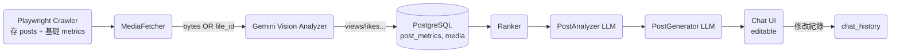

### 先把「能不能直接丟 mp4？」講清楚

最新官方文件已經確認 **Gemini 2.5 Pro／Flash** 原生支援影片：

* **Developer API** & Vertex AI 皆可用 `generate_content()` 接收
  \* < 20 MB → 直接內嵌 bytes
  \* ≥ 20 MB 或要重複用 → 先 `client.files.upload()` ，然後把 `file` 物件放進 contents array
* 同一次請求最多 **10 部** 影片（2.5 之後）([Google AI for Developers][1])
* 支援格式：`mp4, webm, mov, avi, ...`；單檔上限 2 GB – 以官方 FAQ 為準([Google 支援][2])

> 所以 **不必再把影片抽成影格**，除非你需要自訂採樣方式或想省 Token。

---

## 建議的三段式流程（只動必要檔案）

```
Playwright crawler  ➜  MediaFetcher  ➜  GeminiVisionAnalyzer  ➜  DB  ➜  PostAnalyzer
```

| 階段                          | 要做事                                       | 關鍵檔 / 函式                                       | 是否落地檔案                                      |
| --------------------------- | ----------------------------------------- | ---------------------------------------------- | ------------------------------------------- |
| **1. 爬蟲**                   | 收集 URL + 排名 + 權重                          | `playwright_crawler` (已完成)                     | 否                                           |
| **2. MediaFetcher**         | 下載 **圖片 / 影片**；決定「inline」或 `files.upload` | **新增** `agents/media_fetcher/fetcher_logic.py` | *可選*：<br>小檔 inline；大檔直接丟 Files API（不一定要 S3） |
| **3. GeminiVisionAnalyzer** | 把 bytes 或 file ref 傳給 Gemini 2.5 Pro      | 修改你現有 `GeminiVisionAnalyzer`                   | 否（即取即丟）                                     |

### 2 MediaFetcher（最小 code 片段）

```python
async def fetch_media(url: str) -> bytes:
    async with aiohttp.ClientSession() as s:
        async with s.get(url, timeout=30) as r:
            r.raise_for_status()
            return await r.read()
```

```python
async def prep_for_gemini(media_bytes: bytes, mime="video/mp4"):
    if len(media_bytes) < 20 * 1024 * 1024:          # <20 MB
        return genai.VideoPart(media_bytes, mime)    # 直接內嵌
    else:
        file_obj = genai.client.files.upload(file_content=media_bytes,
                                             mime_type=mime)
        return file_obj              # 交給 Analyzer 放進 contents
```

### 3 GeminiVisionAnalyzer（只改兩處）

```python
from google import genai
...
def __init__(...):
    self.model = genai.GenerativeModel("gemini-2.5-pro")

async def analyze_media(self, parts: list[genai.Part|genai.File]) -> dict:
    resp = self.model.generate_content(
        contents=[*parts,
                  genai.TextPart(self.prompt_template)],
        safety_settings=self.safety_settings,
        generation_config=genai.types.GenerationConfig(
            temperature=0.1, top_p=0.8, max_output_tokens=256
        )
    )
    return json.loads(resp.text)   # 你的 _parse_number() 保留即可
```

呼叫端（Fetcher → Analyzer）：

```python
media_bytes = await fetch_media(post["videos"][0] or post["images"][0])
part_or_file = await prep_for_gemini(media_bytes, mime="video/mp4" if post["videos"] else "image/jpeg")
result = await analyzer.analyze_media([part_or_file])
await db.update_metrics_from_vision(post["post_id"], result)
```

---

## 是否還需要 S3？

| 需求                    | 建議                                                    |
| --------------------- | ----------------------------------------------------- |
| **一次分析即丟**（量不大、成本最低）  | 直接 memory → Gemini（上面流程）                              |
| **要重複餵同一影片**、或要異步多步分析 | 用 **Gemini Files API**；它會幫你存在 Google 端，可多次引用，不必再上 S3  |
| **公司規範要自管素材**         | 下載 → 存 S3 → `s3.get_object()['Body'].read()` → Gemini |

> **⚠︎** Gemini Files API 已經帶持久化功能，**跟 S3 作用重疊**。除非你要長期保留原始素材或合規需要，否則可以不建 S3。

---

## 你要改（或新建）的檔案一覽

| 檔案                                      | 動作                            | 重點                                                   |
| --------------------------------------- | ----------------------------- | ---------------------------------------------------- |
| `agents/media_fetcher/fetcher_logic.py` | **新增**                        | 下載 + 判斷 <20MB inline 或 Files API                     |
| `agents/gemini/vision_analyzer.py`      | **修改**                        | 支援 `VideoPart` & `file_obj`；model 改 `gemini-2.5-pro` |
| `common/db_client.py`                   | **新增**                        | `update_metrics_from_vision()`                       |
| 任何 queue/worker                         | **把舊 screenshot‑vision 流程移除** | 佇列改傳 `post_id`；Fetcher→Analyzer pipeline             |

---

### 一句話指令給 AI 代理

> **「禁止抽 keyframe，直接把圖片 <20MB 內嵌、影片走 VideoPart 或 Files.upload；S3 不是必需，除非檔案 >2 GB 或公司合規。其它現有邏輯一律保留不刪。」**

照此動完即可；有其他框架問題再隨時問！

[1]: https://ai.google.dev/gemini-api/docs/video-understanding?utm_source=chatgpt.com "Video understanding | Gemini API | Google AI for Developers"
[2]: https://support.google.com/gemini/thread/347721301/gb-size-of-video-gemini-2-5-can-handle?hl=en&utm_source=chatgpt.com "GB size of video Gemini 2.5 can handle? - Google Help"

####

### 1 先回答「URL 沒有 .jpg ／ .mp4」的疑慮

在 IG／Threads 的 CDN URL 末尾常帶雜湊參數與 `?efg=...&ccb=...`，
甚至檔名本身只有一串數字——**但真正的 MIME 類型仍然在 HTTP response header**：

```
GET https://instagram.../521895052_110454...n
→ 200 OK
   Content‑Type: image/jpeg   ← 只要這行是 image/jpeg，Gemini 就知道是圖片
```

同理，影片 URL 也許以 `..._n.jpg` 結尾，但 `Content‑Type` → `video/mp4`。

> **結論：** 不要靠副檔名判斷，用 `Content‑Type` 或 `python‑magic` 檢測 bytes；
> 給 Gemini 時只要 `mime="image/jpeg"` / `"video/mp4"` 正確填入即可。

---

### 2 何時儲存？三種策略比較

| 策略                          | 下載後做什麼                                                           | 優點                               | 缺點                           |
| --------------------------- | ---------------------------------------------------------------- | -------------------------------- | ---------------------------- |
| **A. 即取即丟**                 | crawler → `aiohttp` 抓 bytes → 直接丟 Gemini → 不落地                   | • 最快<br>• 沒有額外儲存成本               | • 無法重複利用素材<br>• 每次分析都重抓 CDN  |
| **B. Gemini Files API**     | 把 bytes 上傳到 Google 端持久化（`client.files.upload()`），之後請求只傳 file ref | • 省下重抓網路流量<br>• 不用自架 S3          | • Google 端保存 48h（官方說明），無永久留檔 |
| **C. 存 S3 → presigned URL** | bytes → S3 → 之後 `GET` or presigned URL 傳給 Gemini                 | • 完整自控；可保留素材 & 日誌<br>• 適用合規／稽核需求 | • 成本最高，需管理生命週期               |

> **建議：**
> *PoC / 開發初期* 先走 **A**；
> 若之後要跑定期重分析、或素材較大 (影片 20 MB+) → 升到 **B**；
> 真正上線、法務要求留檔再加 **C**。

---

### 3 資料庫到底要幾張表？

你目前有：`posts`, `post_metrics`, `processing_log`，外加 Redis tier‑0。
**再加兩張就夠：**

| 表                 | 用途                 | 主要欄位                                                                                       |                                                                                                                                                  |
| ----------------- | ------------------ | ------------------------------------------------------------------------------------------ | ------------------------------------------------------------------------------------------------------------------------------------------------ |
| **media**         | 追蹤每篇貼文的媒體下載/上傳狀態   | `post_id (FK)`, \`type (image                                                              | video)`, `cdn\_url`, `storage\_ref (file\_id 或 s3\_key)`, `status ENUM('pending','downloaded','uploaded','analyzed','failed')`, `last\_updated\` |
| **chat\_history** | 儲存「生成貼文─使用者修改」來回訊息 | `id`, `post_id (nullable)`, `user_id`, `role ('user'/'assistant')`, `content`, `timestamp` |                                                                                                                                                  |

> 再把 **metrics 欄位併到 `post_metrics`（已有）**，不用拆 views/likes 表。
> Redis 依舊只放「快取指標」「佇列」「任務狀態」，PostgreSQL 才是長期倉。

---

### 4 流程總覽（更新版）



* **playwright**：寫 `posts`、`post_metrics`(缺 views)；`media` status=`pending`
* **MediaFetcher**：下載 → (<20 MB 用 inline, ≥20 MB 上傳 Files API) → 更新 `media.status='uploaded'` & `storage_ref`
* **GeminiVision**：讀 `media`→ 取得 bytes/file → 產生 views/likes → `post_metrics` 補值
* 後面排名、分析、生成貼文都查同一張 `posts_with_metrics` view

---

### 5 最小程式碼變動

#### media\_fetcher/fetcher\_logic.py

```python
async def fetch_and_upload(media_url:str)->dict:
    bytes_=await download(media_url)
    mime = magic.from_buffer(bytes_, mime=True)     # pip install python-magic
    if mime.startswith("video/") and len(bytes_)>=20*1024*1024:
        file = genai.client.files.upload(file_content=bytes_, mime_type=mime)
        storage_ref = file.name                    # e.g. "files/abc..."
    else:
        part = genai.VideoPart(bytes_, mime) if mime.startswith("video/") \
               else genai.ImagePart(bytes_, mime)
        storage_ref = part                         # 直接傳 Part 物件
    await db.update_media(post_id, status="uploaded", storage_ref=str(storage_ref))
    return {"mime":mime, "ref":storage_ref}
```

#### gemini/vision\_analyzer.py

```python
async def analyze(self, storage):
    contents=[storage, genai.TextPart(self.system_prompt)]
    resp=self.model.generate_content(contents, safety_settings=..., generation_config=...)
    return json.loads(resp.text)
```

---

### 6 回答零碎問題

1. **為什麼 URL 看起來像 `.jpg` 但實際是 mp4？**
   IG 會在同一路徑下提供不同檔案，真正格式以 `Content‑Type` 為準。

2. **可以直接把爬到的 JSON 存檔就好嗎？**
   可以當作「raw backup」，但正式查詢、JOIN、排名還是進 DB 最方便；SQL → view → BI 工具。

3. **「資料庫很亂」的整理順序**

   1. 先確定 **最終查詢場景**：排名、分析要跨貼文比對 → 定義 view
   2. 設計表結構（如上 5 張）
   3. 寫 migration，把舊 JSON 批次匯入

4. **用戶修改貼文也要存**
   存在 `chat_history`；最後一次改稿可寫回 `posts.markdown`，保留原生成版於 history。

---

### 7 下一步行動清單

1. **MediaFetcher**：實作 `download`＋`magic` 檢測＋Files API 上傳；寫入 `media` 表
2. **GeminiVisionAnalyzer**：改成可接收 `ImagePart|VideoPart|file_ref`
3. **DB migration**：新增 `media`, `chat_history`；`posts_with_metrics` view
4. **PlaywrightCrawler**：寫 `media_urls` 到 `media`；把 `post_metrics.views_count` NULL
5. **清理**：移除 `vision_fill_logic.py` 舊截圖路徑

完成後即可真正做到：**爬→下載→Gemini 影片/圖分析→統一 DB→LLM 生成/修改循環**。 有任何實作細節再提問！
